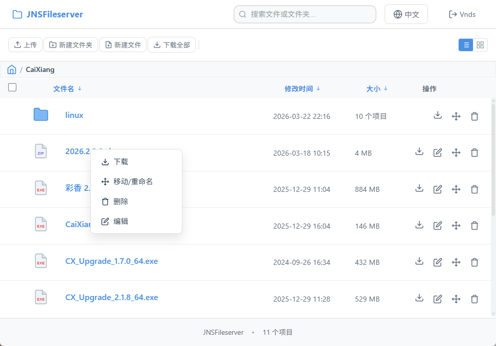
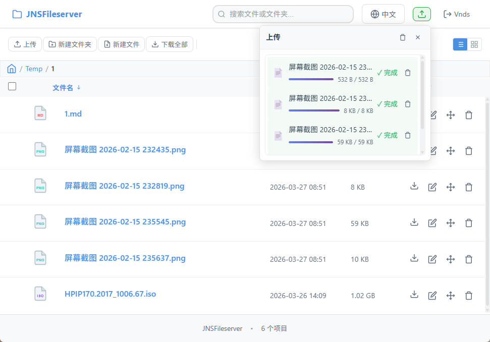
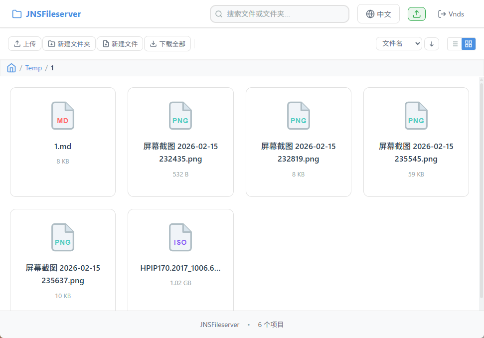

# Dufs Web

A modern web file server frontend interface that provides an intuitive and efficient file management and upload/download experience.

## ⚠️ Disclaimer

**Important Notice:**

- This program is entirely written by AI; the author has no programming knowledge
- No guarantee is provided regarding the security or stability of the code
- Users must evaluate and use it at their own risk according to their specific circumstances
- The code is publicly released under the MIT Open Source License
- Current version development is based on [dufs](https://github.com/sigoden/dufs) v0.45.0
- For feature modification requests or good suggestions, the author will try to address them but cannot guarantee timeliness
- Please use with caution and carefully consider deployment in production environments

**Usage Recommendations:**
- Recommended for use in internal networks or trusted environments
- Not recommended for direct exposure to public internet
- Please backup your data before use
- Conduct a security audit before using in production environments

---

## 📖 Introduction

Dufs Web is a feature-rich file server **web frontend** solution built with vanilla JavaScript, requiring no framework dependencies. It offers a cloud-drive-like file management experience with support for file upload, download, preview, editing, and more.



## ✨ Core Features

### 🎯 File Management
- **Dual View Modes**: Switch between list view and grid view to suit different preferences
- **Smart Sorting**: Sort by name, modified time, or size with ascending/descending order
- **Bulk Operations**: Select multiple files for batch delete and download
- **Drag Selection**: List view supports mouse drag for quick multi-selection
- **Keyboard Shortcuts**: Ctrl/Shift + click for continuous selection
- **Context Menu**: Right-click files for quick access to download, move, delete, edit operations

### 📤 File Upload
- **Drag & Drop Upload**: Drag files or folders onto the page to upload
- **Resume Support**: Resume interrupted upload tasks
- **Concurrency Control**: Smart control of simultaneous uploads (default: 3)
- **Real-time Progress**: Floating panel displays upload progress, speed, and remaining time
- **File Verification**: Verifies file name and size when resuming uploads
- **Auto Retry**: Manual retry support for failed uploads
- **Task Management**: Clean up completed/failed upload tasks

### 📥 File Download
- **Single File Download**: Direct download for individual files
- **Bulk ZIP Download**: Package multiple selected files into a ZIP
- **Streaming Download**: ReadableStream-based download with real-time progress
- **Smart Fallback**: Automatically falls back to individual downloads when size limit exceeded
- **Token Authentication**: Logged-in users get secure token-based downloads
- **Directory Packaging**: Download entire directories as ZIP

### 📝 File Preview & Editing
- **Online Editor**: Support for editing multiple text file formats
  - Code files: `.js`, `.ts`, `.jsx`, `.tsx`, `.vue`, `.py`, `.java`, `.c`, `.cpp`, etc.
  - Config files: `.json`, `.yaml`, `.yml`, `.xml`, `.ini`, `.conf`, `.toml`, etc.
  - Document files: `.txt`, `.md`, `.markdown`, `.html`, `.css`, `.scss`, etc.
- **File Preview**: Browser preview for multiple file formats
  - Images: `.jpg`, `.png`, `.gif`, `.bmp`, `.svg`, `.webp`, etc.
  - Videos: `.mp4`, `.mov`, `.avi`, `.wmv`, `.flv`, `.webm`, etc.
  - Audio: `.mp3`, `.ogg`, `.wav`, `.m4a`, etc.
  - Documents: `.pdf`, etc.
- **Save Prompt**: Confirmation prompt when closing page with unsaved changes

### 🔐 User Authentication
- **Login/Logout**: User login and logout functionality
- **Permission Control**: Show/hide feature buttons based on user permissions
- **Secure Download**: Token authentication automatically added for logged-in users

### 🌍 Internationalization
- **Multi-language Support**:
  - 🇨🇳 简体中文
  - 🇺🇸 English
- **Auto Detection**: Automatically detects and applies system language
- **Persistence**: Language settings saved in localStorage
- **Real-time Switch**: Instant UI update when switching languages



### 🎨 User Experience
- **Responsive Design**: Adapts to desktop and mobile devices
- **Smart Scrollbars**: Automatically show/hide scrollbars based on content
- **Breadcrumb Navigation**: Clear path display with click-to-navigate
- **Toast Notifications**: Real-time feedback for operation results
- **Modal Dialogs**: Standardized interactions for confirm, input, and alerts
- **File Count**: Real-time display of file and folder counts in current directory
- **Empty State**: Friendly prompts for empty folders or no search results

### 🛡️ Security
- **Filename Validation**: Prevents path traversal attacks
  - Blocks `/` and `\` path separators
  - Blocks `..` path traversal
  - Blocks control characters
  - Blocks Windows reserved names (CON, PRN, AUX, etc.)
- **XSS Protection**: All user input is HTML entity encoded
- **Page Unload Protection**: Confirmation prompt when unsaved content or active tasks exist



## 🚀 Quick Start

### Prerequisites

- Modern browser (Chrome, Firefox, Edge, Safari, etc.)
- Backend server support (required API endpoints)

### File Structure

```
assets/
├── index.html      # Main page
├── app.js          # Main application logic
├── utils.js        # Utility functions and constants
├── auth.js         # Authentication utilities
├── i18n.js         # Internationalization config
├── uploader.js     # Upload manager
├── jszip.min.js    # JSZip library (for ZIP download)
├── base.css        # Base styles
└── components.css  # Component styles
```

### Integration Steps

1. **Include Required Files**

Include CSS and JS files in your HTML:

```html
<link rel="stylesheet" href="assets/base.css">
<link rel="stylesheet" href="assets/components.css">
```

```html
<script src="assets/jszip.min.js"></script>
<script src="assets/i18n.js"></script>
<script src="assets/utils.js"></script>
<script src="assets/auth.js"></script>
<script src="assets/uploader.js"></script>
<script src="assets/app.js"></script>
```

2. **Configure Backend API**

Backend should provide the following API endpoints:

- `GET /path?json` - Get directory contents (JSON format)
- `GET /path?zip` - Download directory as ZIP
- `GET /path?tokengen` - Generate download token
- `PUT /path` - Upload/create file
- `DELETE /path` - Delete file/directory
- `MKCOL /path` - Create directory
- `MOVE /path` - Move/rename file (requires Destination header)
- `CHECKAUTH /path` - Check authentication status
- `LOGOUT /path` - Logout

3. **Data Format**

JSON response format from backend:

```json
{
  "href": "/path/to/dir",
  "uri_prefix": "/",
  "kind": "Index",
  "dir_exists": true,
  "allow_archive": true,
  "allow_upload": true,
  "allow_delete": true,
  "allow_search": true,
  "user": "username",
  "paths": [
    {
      "name": "file.txt",
      "path_type": "File",
      "mtime": 1234567890,
      "size": 1024
    }
  ]
}
```

## 📋 Configuration

### Upload Configuration

```javascript
// Maximum concurrent uploads
const DUFS_MAX_UPLOADINGS = 3;

// Maximum subpath count (directory size display limit)
const MAX_SUBPATHS_COUNT = 1000;
```

### Bulk Download Configuration

```javascript
// Maximum file size for combined download (MB)
const _maxDownloadSize = 200;
```

### Supported File Formats

**Editable Formats** (EDITOR_FORMATS):
- Text files: `.txt`, `.md`, `.markdown`
- Code files: `.js`, `.ts`, `.jsx`, `.tsx`, `.vue`, `.py`, `.java`, `.c`, `.cpp`, `.h`, `.hpp`, `.cs`, `.php`, `.go`, `.rs`, `.swift`, `.kt`, `.rb`
- Config files: `.json`, `.yaml`, `.yml`, `.xml`, `.html`, `.htm`, `.css`, `.scss`, `.less`, `.ini`, `.conf`, `.cfg`, `.env`, `.toml`, `.sql`
- Others: `.log`, `.csv`, `.gitignore`, `.dockerignore`

**Preview Formats** (IFRAME_FORMATS):
- Images: `.pdf`, `.jpg`, `.jpeg`, `.png`, `.gif`, `.bmp`, `.svg`
- Videos: `.mp4`, `.mov`, `.avi`, `.wmv`, `.flv`, `.webm`
- Audio: `.mp3`, `.ogg`, `.wav`, `.m4a`

## 🎯 User Guide

### File Upload

1. Click the "Upload" button in the toolbar, or drag files/folders onto the page
2. Upload panel opens automatically, showing upload progress
3. Supports pause, retry, and cancel operations
4. Prompts to resume upload if interrupted

### Bulk Operations

**List View**:
- Click checkbox to select individual files
- Drag mouse for bulk selection
- Ctrl + click to toggle selection
- Shift + click for range selection

**Grid View**:
- Long press file to enter selection mode
- Click file to toggle selection
- Click "Exit Selection" to leave selection mode

**Bulk Actions**:
- Bulk action bar appears after selecting files
- Click "Download" to package selected files
- Click "Delete" to batch delete selected files

### File Editing

1. Click "Edit" button on editable files
2. Modify content in the editor
3. Click "Save" button to save changes
4. Supports move/rename and delete operations

### File Preview

- Click image, video, audio, or PDF files to preview directly
- Uses browser's built-in viewer

### Search Function

1. Enter keywords in the top search box
2. Automatically searches current directory and subdirectories
3. Search results displayed in list format

## 🔧 API Reference

### Utility Functions

**URL Utilities**:
- `baseUrl()` - Get current base URL
- `newUrl(name)` - Build URL for new file/directory
- `baseName(url)` - Extract filename from URL
- `extName(filename)` - Get file extension

**Formatting Utilities**:
- `formatMtime(mtime)` - Format modified time
- `formatDirSize(size)` - Format directory size
- `formatFileSize(size)` - Format file size
- `formatDuration(seconds)` - Format duration
- `formatSpeed(speed)` - Format speed

**File Icons**:
- `getFileIcon(filename, path_type)` - Get file icon SVG

**Validation Utilities**:
- `validateFileName(filename)` - Validate filename security

### Authentication Functions

- `fetchWithAuth(url, options)` - Fetch wrapper with authentication
- `showLogoutModal()` - Show logout modal
- `hideLogoutModal()` - Hide logout modal

### Internationalization

- `t(key, ...args)` - Translation function
- `setLanguage(lang)` - Set current language
- `loadLanguage()` - Load saved language settings
- `updateTranslations()` - Update page translations

## 🎨 Customization

### Theme Customization

Customize theme by modifying CSS variables:

```css
:root {
  --primary-color: #2563eb;
  --danger-color: #dc2626;
  --success-color: #16a34a;
  /* ... more variables see base.css */
}
```

### Language Extension

Add new language config in `i18n.js`:

```javascript
const I18N = {
  'zh-CN': { /* ... */ },
  'en-US': { /* ... */ },
  'ja-JP': {
    // Add Japanese translations
    searchPlaceholder: 'ファイルやフォルダを検索...',
    // ... other translations
  }
};
```

### Icon Customization

Modify icon mapping in `utils.js`:

```javascript
const _EXT_LABEL = {
  '.jpg': 'JPG',
  '.png': 'PNG',
  // Add or modify extension labels
};

const _EXT_COLOR = {
  '.jpg': '#FF6B6B',
  '.png': '#4ECDC4',
  // Add or modify extension colors
};
```

## 🐛 Troubleshooting

### 1. Upload Failed

**Cause**: Network issues or server limitations

**Solution**:
- Check network connection
- Verify server configuration (file size limits, timeout settings, etc.)
- Try uploading again

### 2. Bulk Download Failed

**Cause**: Files too large or contains directories

**Solution**:
- Reduce number of selected files
- Adjust `_maxDownloadSize` configuration
- Use individual download mode

### 3. Editor Cannot Open File

**Cause**: File format not supported or file too large

**Solution**:
- Check if file extension is in `EDITOR_FORMATS` list
- Verify file size is suitable for online editing

### 4. Language Switch Not Working

**Cause**: Browser cache or localStorage issues

**Solution**:
- Clear browser cache
- Clear localStorage and try again

## 📝 Changelog

### v1.0.0
- ✨ Initial release
- 🎯 Support for file upload, download, preview, editing
- 🌍 Bilingual support (Chinese and English)
- 📱 Responsive design for mobile devices
- 🔐 User authentication and permission control
- 📦 Bulk operations and ZIP download

## 📄 License

This project is licensed under the [MIT License](LICENSE)

## 🤝 Contributing

Issues and Pull Requests are welcome!

## 📧 Contact

For questions or suggestions, please reach out via Issues.

---

**Dufs Web** - Simple, efficient, modern file server web frontend solution
